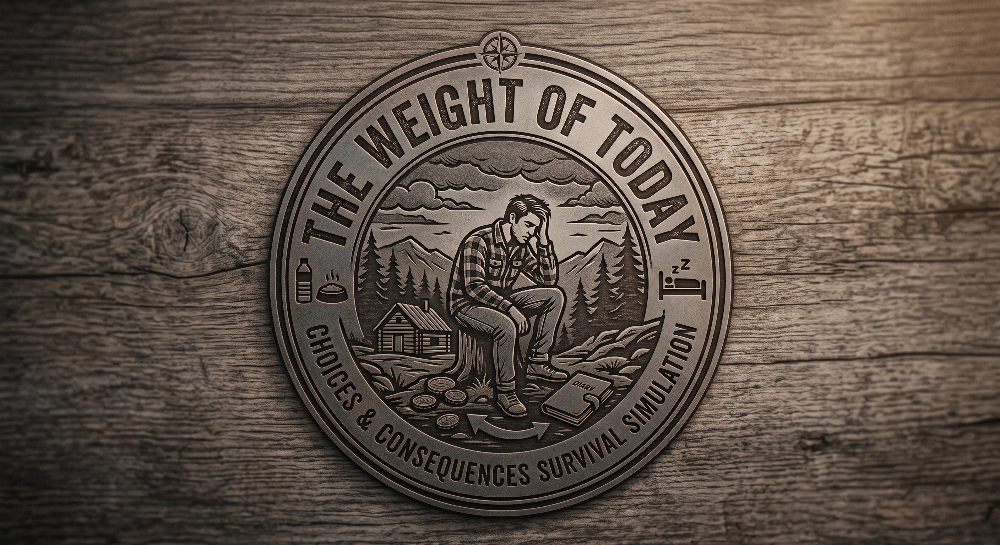

# The Weight of Today

é um jogo de sobrevivência em que você precisa gerenciar seus recursos e tomar decisões estratégicas para sobreviver o maior tempo possível. O objetivo é acumular recursos suficientes para vencer o jogo, enquanto mantém sua vida e energia em níveis aceitáveis.

### como jogar: 
  você pode clicar nos botões correspondentes às ações que deseja realizar. Cada ação terá um efeito diferente em seus recursos, vida e energia. Fique atento aos seus níveis de vida e energia para não perder o jogo.

### existem 4 formas de jogar o jogo
  trabalhar: você pode trabalhar para ganhar recursos, mas isso consome energia e pode deixar você mais cansado.

  comer: você pode comer para recuperar sua vida, mas isso consome comida.

  descansar: você pode descansar para recuperar sua energia, mas isso consome tempo e não gera recursos.

  explorar: você pode explorar o mundo para encontrar recursos e itens, mas isso pode ser perigoso e consumir energia.

### Como ganhar o jogo: 
  você precisa acumular 50 recursos para vencer o jogo. Se sua vida ou energia chegar a zero, você perde o jogo.

### como perder o jogo: 
  se sua vida ou energia chegar a zero, você perde o jogo. Fique atento aos seus níveis de vida e energia para não perder o jogo.

### sobre o projeto
  este projeto foi desenvolvido como parte de um desafio de programação. O objetivo era criar um jogo simples de sobrevivência usando React e TypeScript. O código está disponível no GitHub para quem quiser estudar ou contribuir com melhorias.
